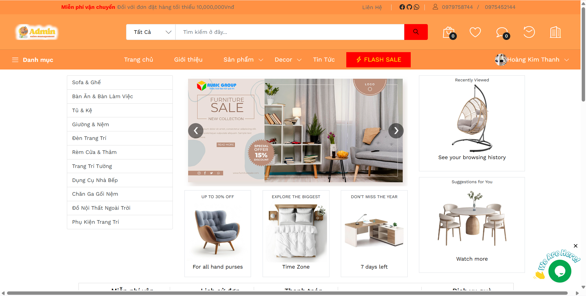

# 🛋️ Final Project - Web Shop Nội Thất


## 🚀 Giới thiệu
Đây là một **web shop mua bán nội thất** được xây dựng bằng ASP.NET Core MVC.  
Người dùng có thể:
- Xem danh sách sản phẩm
- Đăng ký / đăng nhập
- Thêm sản phẩm vào giỏ hàng
- Thanh toán online (demo)

## 📦 Chức năng mở rộng
Ngoài các chức năng cơ bản, hệ thống còn hỗ trợ:

### 👤 Quản lý tài khoản & phân quyền
- Phân loại tài khoản (Admin, Nhân viên, Khách hàng) thông qua `LoaiTaiKhoan`.
- Quản lý hồ sơ người dùng, lịch sử hoạt động, và quyền truy cập.

### 🛒 Quản lý đơn hàng nâng cao
- Theo dõi trạng thái đơn hàng (`TrangThai`).
- Xem chi tiết đơn hàng (`ChiTietDonHang`).
- Xuất hóa đơn (`HoaDon`).

### ⚡ Flash Sale & Khuyến mãi
- Cấu hình thời gian bắt đầu/kết thúc.
- Giảm giá theo % hoặc số tiền cố định.
- Tự động hết hiệu lực khi qua hạn.

### 📦 Quản lý kho & nhập hàng
- Theo dõi tồn kho (`NhapKho`).
- Quản lý lịch sử nhập hàng (`ChiTietNhapKho`).
- Quản lý nhà cung cấp (`NhaCungCap`).

### ⭐ Đánh giá & phản hồi sản phẩm
- Người dùng đánh giá sản phẩm (`DanhGia`).
- Shop phản hồi bình luận (`PhanHoi`).
- Hiển thị đánh giá trung bình.

### 🏷️ Danh mục & thương hiệu
- Quản lý sản phẩm theo danh mục (`DanhMuc`), thương hiệu (`ThuongHieu`).
- Lọc sản phẩm theo tiêu chí.

### 📰 Tin tức & Decor
- Tin tức khuyến mãi và mẹo trang trí (`TinTuc`).
- Gợi ý phối đồ nội thất (`Decor`).

### ❤️ Sản phẩm yêu thích
- Lưu danh sách sản phẩm muốn mua sau (`SanPhamYeuThich`).

### 📍 Quản lý địa chỉ giao hàng
- Lưu nhiều địa chỉ cho 1 tài khoản (`DiaChiNguoiDung`).
- Chọn địa chỉ mặc định khi thanh toán.

### Logo Web


### Giao diện trang chủ


### Giao diện Admin


### GIF tương tác


### Nhóm sinh viên thực hiện
| Họ và Tên              | Mã Số Sinh Viên |
|------------------------|------------------|
| Võ Duy Toàn            | 2200002076       |
| Phan Minh Thuận        | 2200010286       |
| Nguyễn Thị Huyền Diệu  | 2200001765       |
| Nguyễn Văn Thuận       | 2200009501       |

## 🛠️ Hướng dẫn cài đặt
Clone repo về máy:
```bash
git clone https://github.com/ThuanVan060504/Final-Project.git
cd Final-Project
